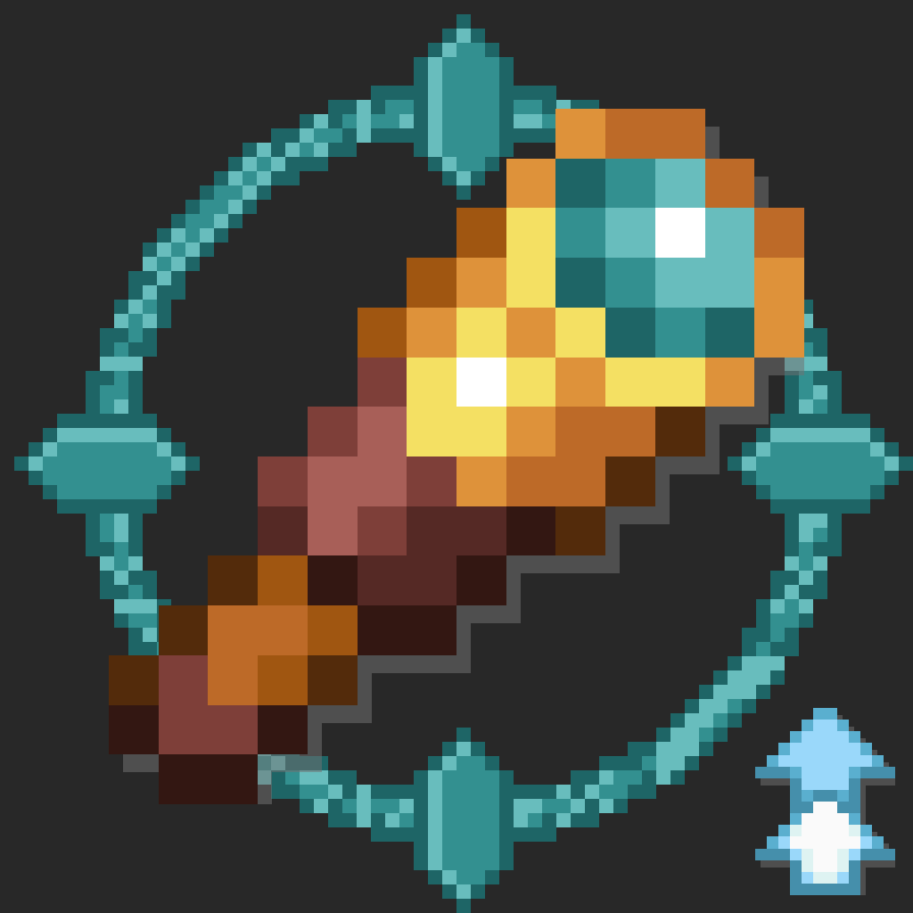

# 🔍 Functional Spyglass

**Functional Spyglass** turns your standard Minecraft Spyglass into a tactical client-side inspection HUD! Inspect live **3D face portraits**, exact **health & Effective Health (EHP) math**, **armor reduction**, **mount speed/jump stats**, and **active potion effects** for any mob, animal, creature, or player across any server.

---

## ✨ Key Features

### 🖼️ 3D Live Face Portraits & Entity Inspection
Displays an ARK-style 3D portrait plaque with universal eye-anchored matrix centering (zero world mob lag or walking stutter). Works on all mobs, animals, and players on multiplayer servers!

### 🐎 Mount Stats Scanner
Hover over Horses, Donkeys, Mules, or Camels to instantly see:
* 🏃 **Movement Speed** (in m/s)
* ⬆️ **Jump Height** (in blocks)
* ⭐ **Taming Status & Owner Name**

### 🛡️ Real-Time Combat Math & Effective Health (EHP)
* 💚 **HP Bar:** Color-coded health (Green > 50%, Yellow > 25%, Red < 25%).
* 🛡️ **Armor Reduction Math:** Calculates true damage mitigation percentage.
* ⚔️ **Effective Health (EHP):** Calculates how much raw damage is required to defeat armored targets.

### 🌟 Smart Threat Color Outlines
* 🟢 **Green:** Friendly & passive animals / villagers.
* ⚪ **White:** Neutral creatures (Spiders in daytime, Iron Golems, Endermen, Bees).
* 🔴 **Red:** Hostile monsters and angry mobs.
* 💖 **Pink:** Tamed pets and mounts.

### 🔍 3-Step Scroll Zoom
Use your **Mouse Scroll Wheel** while scoping to zoom in and out dynamically (`0.5x`, `1.0x`, `2.0x`).

---

## 📦 Project Structure

* **`fabric/`** — Standalone Fabric client mod project.
* **`neoforge/`** — Standalone NeoForge client mod project.
* **`forge/`** — Classic Forge client mod project.

---

## ⚙️ Modpacks & License

* **License:** MIT License
* **Multiplayer:** 100% Client-Side Compatible on any server
* **Modpack Usage:** You are completely free to include **Functional Spyglass** in any public or private modpack!
